# Atlantic Forest Birds - Photo & Audio Attributions

**Giant Snipe** (*Gallinago undulata*)  
  
Photo: [(c) luizanjos, some rights reserved (CC BY-NC)](https://www.inaturalist.org/observations/317397195) | [CC BY NC](https://creativecommons.org/licenses/by-nc/4.0/)  
Audio: [Bobby Wilcox](https://xeno-canto.org/391820) via [Xeno-Canto](https://xeno-canto.org/contributor/YHKQPPJDVP) | [CC BY-NC-SA 4.0](https://creativecommons.org/licenses/by-nc-sa/4.0/)  

**Boat-billed Heron** (*Cochlearius cochlearius*)  
  
Photo: [(c) Thomaz de Carvalho Callado, some rights reserved (CC BY)](https://www.inaturalist.org/observations/326359013) | [CC BY](https://creativecommons.org/licenses/by/4.0/)  
Audio: [Bobby Wilcox](https://xeno-canto.org/391953) via [Xeno-Canto](https://xeno-canto.org/contributor/YHKQPPJDVP) | [CC BY-NC-SA 4.0](https://creativecommons.org/licenses/by-nc-sa/4.0/)  

**Grey-headed Kite** (*Leptodon cayanensis*)  
  
Photo: [(c) Lucas Silva, some rights reserved (CC BY-NC)](https://www.inaturalist.org/observations/326467086) | [CC BY NC](https://creativecommons.org/licenses/by-nc/4.0/)  
Audio: [Bobby Wilcox](https://xeno-canto.org/366563) via [Xeno-Canto](https://xeno-canto.org/contributor/YHKQPPJDVP) | [CC BY-NC-SA 4.0](https://creativecommons.org/licenses/by-nc-sa/4.0/)  

**Great Black Hawk** (*Buteogallus urubitinga*)  
  
Photo: [(c) Bruno Oliani, some rights reserved (CC BY-NC)](https://www.inaturalist.org/observations/328550489) | [CC BY NC](https://creativecommons.org/licenses/by-nc/4.0/)  
Audio: [Bobby Wilcox](https://xeno-canto.org/391364) via [Xeno-Canto](https://xeno-canto.org/contributor/YHKQPPJDVP) | [CC BY-NC-SA 4.0](https://creativecommons.org/licenses/by-nc-sa/4.0/)  

**East Brazilian Pygmy Owl** (*Glaucidium minutissimum*)  
  
Photo: [(c) fabiomanfredini, some rights reserved (CC BY-NC)](https://www.inaturalist.org/observations/326688013) | [CC BY NC](https://creativecommons.org/licenses/by-nc/4.0/)  
Audio: [Bobby Wilcox](https://xeno-canto.org/391941) via [Xeno-Canto](https://xeno-canto.org/contributor/YHKQPPJDVP) | [CC BY-NC-SA 4.0](https://creativecommons.org/licenses/by-nc-sa/4.0/)  

# Atlantic Forest Birds - Photo & Audio Attributions

**Solitary Tinamou** (*Tinamus solitarius*)  
  
Photo: [(c) Luciano Bernardes, some rights reserved (CC BY-NC)](https://www.inaturalist.org/observations/327441465) | [CC BY NC](https://creativecommons.org/licenses/by-nc/4.0/)  
Audio: [Bobby Wilcox](https://xeno-canto.org/397296) via [Xeno-Canto](https://xeno-canto.org/contributor/YHKQPPJDVP) | [CC BY-NC-SA 4.0](https://creativecommons.org/licenses/by-nc-sa/4.0/)  

**Brown Tinamou** (*Crypturellus obsoletus*)  
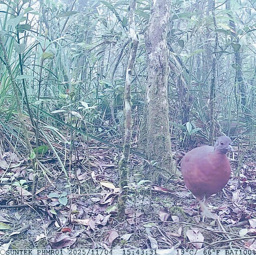  
Photo: [(c) Pedro Henrique Maloso Ramos, some rights reserved (CC BY)](https://www.inaturalist.org/observations/327702005) | [CC BY](https://creativecommons.org/licenses/by/4.0/)  
Audio: [Bobby Wilcox](https://xeno-canto.org/391817) via [Xeno-Canto](https://xeno-canto.org/contributor/YHKQPPJDVP) | [CC BY-NC-SA 4.0](https://creativecommons.org/licenses/by-nc-sa/4.0/)  

**Tataupa Tinamou** (*Crypturellus tataupa*)  
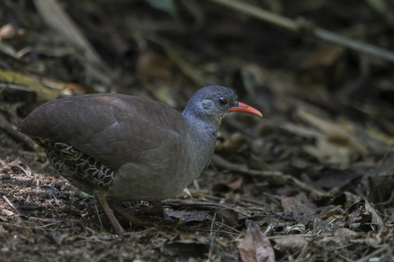  
Photo: [(c) Gustavo C. M. Silva, some rights reserved (CC BY-NC)](https://www.inaturalist.org/observations/328427270) | [CC BY NC](https://creativecommons.org/licenses/by-nc/4.0/)  
Audio: [Bobby Wilcox](https://xeno-canto.org/366124) via [Xeno-Canto](https://xeno-canto.org/contributor/YHKQPPJDVP) | [CC BY-NC-SA 4.0](https://creativecommons.org/licenses/by-nc-sa/4.0/)  

**White-faced Whistling Duck** (*Dendrocygna viduata*)  
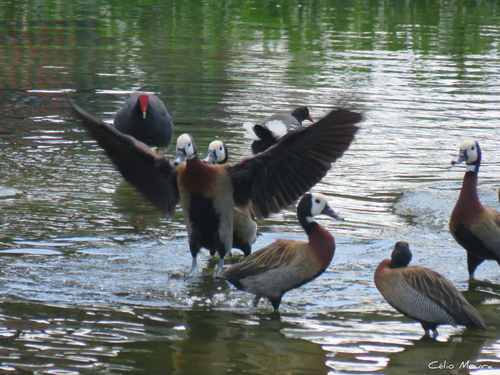  
Photo: [(c) Célio Moura Neto, some rights reserved (CC BY-NC)](https://www.inaturalist.org/observations/328665375) | [CC BY NC](https://creativecommons.org/licenses/by-nc/4.0/)  
Audio: [Bobby Wilcox](https://xeno-canto.org/391228) via [Xeno-Canto](https://xeno-canto.org/contributor/YHKQPPJDVP) | [CC BY-NC-SA 4.0](https://creativecommons.org/licenses/by-nc-sa/4.0/)  

**Black-bellied Whistling Duck** (*Dendrocygna autumnalis*)  
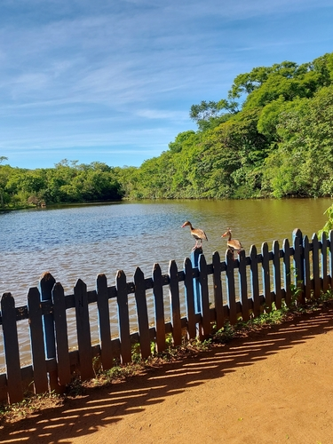  
Photo: [(c) Kerolline, some rights reserved (CC BY-NC)](https://www.inaturalist.org/observations/328470891) | [CC BY NC](https://creativecommons.org/licenses/by-nc/4.0/)  
Audio: [Bobby Wilcox](https://xeno-canto.org/392013) via [Xeno-Canto](https://xeno-canto.org/contributor/YHKQPPJDVP) | [CC BY-NC-SA 4.0](https://creativecommons.org/licenses/by-nc-sa/4.0/)  

**Pauraque** (*Nyctidromus albicollis*)  
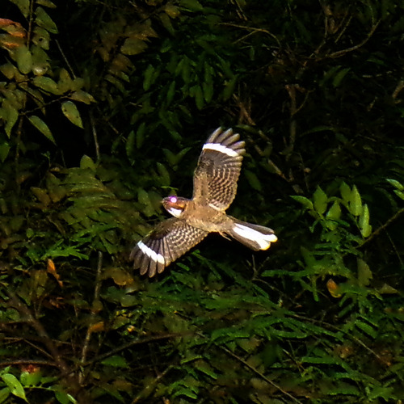  
Photo: [(c) Yby Naturalista, some rights reserved (CC BY-NC)](https://www.inaturalist.org/observations/328417641) | [CC BY NC](https://creativecommons.org/licenses/by-nc/4.0/)  
Audio: [Bobby Wilcox](https://xeno-canto.org/391227) via [Xeno-Canto](https://xeno-canto.org/contributor/YHKQPPJDVP) | [CC BY-NC-SA 4.0](https://creativecommons.org/licenses/by-nc-sa/4.0/)  

**Ocellated Poorwill** (*Nyctiphrynus ocellatus*)  
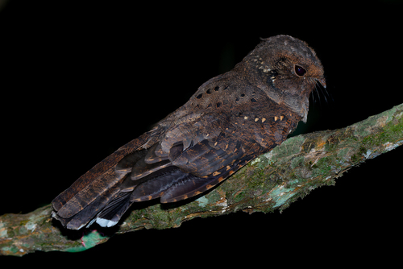  
Photo: [(c) Luciano Bernardes, some rights reserved (CC BY-NC)](https://www.inaturalist.org/observations/327436244) | [CC BY NC](https://creativecommons.org/licenses/by-nc/4.0/)  
Audio: [Bobby Wilcox](https://xeno-canto.org/366924) via [Xeno-Canto](https://xeno-canto.org/contributor/YHKQPPJDVP) | [CC BY-NC-SA 4.0](https://creativecommons.org/licenses/by-nc-sa/4.0/)  

**Common Potoo** (*Nyctibius griseus*)  
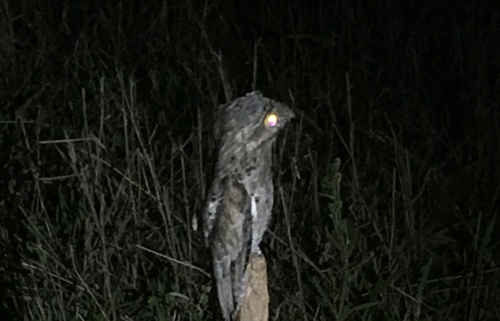  
Photo: [(c) Marcos Severgnini, some rights reserved (CC BY)](https://www.inaturalist.org/observations/328515218) | [CC BY](https://creativecommons.org/licenses/by/4.0/)  
Audio: [Bobby Wilcox](https://xeno-canto.org/388679) via [Xeno-Canto](https://xeno-canto.org/contributor/YHKQPPJDVP) | [CC BY-NC-SA 4.0](https://creativecommons.org/licenses/by-nc-sa/4.0/)  

**Reddish Hermit** (*Phaethornis ruber*)  
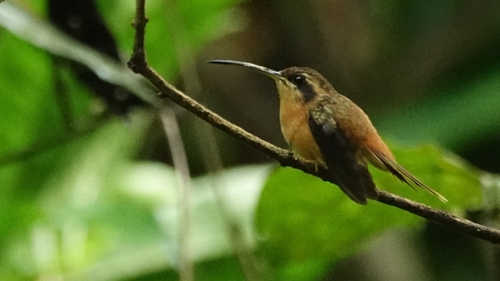  
Photo: [(c) david_sannier_vireon, some rights reserved (CC BY-NC)](https://www.inaturalist.org/observations/328264871) | [CC BY NC](https://creativecommons.org/licenses/by-nc/4.0/)  
Audio: [Bobby Wilcox](https://xeno-canto.org/396161) via [Xeno-Canto](https://xeno-canto.org/contributor/YHKQPPJDVP) | [CC BY-NC-SA 4.0](https://creativecommons.org/licenses/by-nc-sa/4.0/)  

**Scale-throated Hermit** (*Phaethornis eurynome*)  
  
Photo: [(c) David Kidwell, some rights reserved (CC BY-NC-SA)](https://www.inaturalist.org/observations/327652080) | [CC BY NC SA](https://creativecommons.org/licenses/by-nc-sa/4.0/)  
Audio: [Bobby Wilcox](https://xeno-canto.org/391830) via [Xeno-Canto](https://xeno-canto.org/contributor/YHKQPPJDVP) | [CC BY-NC-SA 4.0](https://creativecommons.org/licenses/by-nc-sa/4.0/)  

**White-chinned Sapphire** (*Chlorestes cyanus*)  
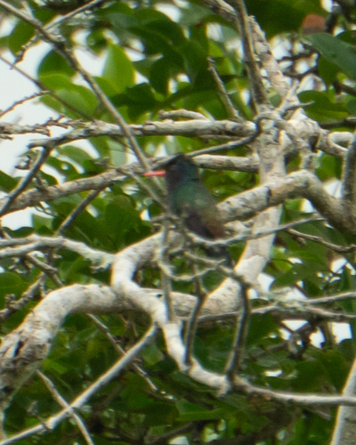  
Photo: [(c) filipeprates, some rights reserved (CC BY)](https://www.inaturalist.org/observations/328156088) | [CC BY](https://creativecommons.org/licenses/by/4.0/)  
Audio: [Bobby Wilcox](https://xeno-canto.org/389560) via [Xeno-Canto](https://xeno-canto.org/contributor/YHKQPPJDVP) | [CC BY-NC-SA 4.0](https://creativecommons.org/licenses/by-nc-sa/4.0/)  

**Guira Cuckoo** (*Guira guira*)  
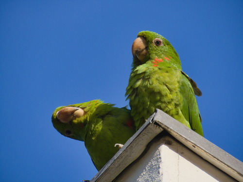  
Photo: [(c) Miguel A. Paixão, some rights reserved (CC BY-NC)](https://www.inaturalist.org/observations/328779659) | [CC BY NC](https://creativecommons.org/licenses/by-nc/4.0/)  
Audio: [Bobby Wilcox](https://xeno-canto.org/391932) via [Xeno-Canto](https://xeno-canto.org/contributor/YHKQPPJDVP) | [CC BY-NC-SA 4.0](https://creativecommons.org/licenses/by-nc-sa/4.0/)  

**Striped Cuckoo** (*Tapera naevia*)  
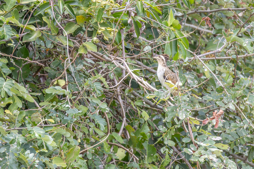  
Photo: [(c) Francisco V. Bezerra Neto, some rights reserved (CC BY-SA)](https://www.inaturalist.org/observations/328464235) | [CC BY SA](https://creativecommons.org/licenses/by-sa/4.0/)  
Audio: [Bobby Wilcox](https://xeno-canto.org/391363) via [Xeno-Canto](https://xeno-canto.org/contributor/YHKQPPJDVP) | [CC BY-NC-SA 4.0](https://creativecommons.org/licenses/by-nc-sa/4.0/)  

**Squirrel Cuckoo** (*Piaya cayana*)  
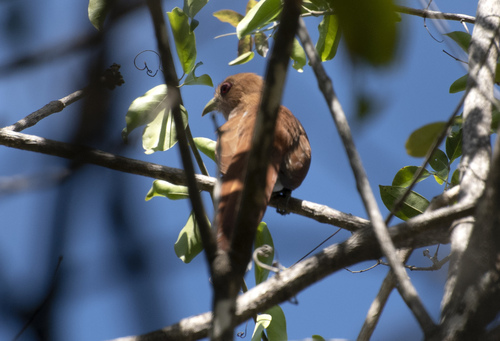  
Photo: [(c) eduardovieira17, some rights reserved (CC BY-NC)](https://www.inaturalist.org/observations/328656042) | [CC BY NC](https://creativecommons.org/licenses/by-nc/4.0/)  
Audio: [Bobby Wilcox](https://xeno-canto.org/391951) via [Xeno-Canto](https://xeno-canto.org/contributor/YHKQPPJDVP) | [CC BY-NC-SA 4.0](https://creativecommons.org/licenses/by-nc-sa/4.0/)  

**Blue Ground Dove** (*Claravis pretiosa*)  
  
Photo: [(c) rogeriotruglio, some rights reserved (CC BY-NC)](https://www.inaturalist.org/observations/328637095) | [CC BY NC](https://creativecommons.org/licenses/by-nc/4.0/)  
Audio: [Bobby Wilcox](https://xeno-canto.org/389564) via [Xeno-Canto](https://xeno-canto.org/contributor/YHKQPPJDVP) | [CC BY-NC-SA 4.0](https://creativecommons.org/licenses/by-nc-sa/4.0/)  

**White-tipped Dove** (*Leptotila verreauxi*)  
  
Photo: [(c) Bruno Oliani, some rights reserved (CC BY-NC)](https://www.inaturalist.org/observations/328508883) | [CC BY NC](https://creativecommons.org/licenses/by-nc/4.0/)  
Audio: [Bobby Wilcox](https://xeno-canto.org/366505) via [Xeno-Canto](https://xeno-canto.org/contributor/YHKQPPJDVP) | [CC BY-NC-SA 4.0](https://creativecommons.org/licenses/by-nc-sa/4.0/)  

**Blackish Rail** (*Pardirallus nigricans*)  
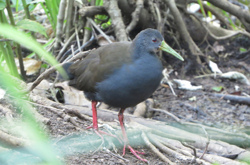  
Photo: [(c) Gabriel Völker Lacerda, some rights reserved (CC BY-NC)](https://www.inaturalist.org/observations/328783115) | [CC BY NC](https://creativecommons.org/licenses/by-nc/4.0/)  
Audio: [Bobby Wilcox](https://xeno-canto.org/391229) via [Xeno-Canto](https://xeno-canto.org/contributor/YHKQPPJDVP) | [CC BY-NC-SA 4.0](https://creativecommons.org/licenses/by-nc-sa/4.0/)  

**Purple Gallinule** (*Porphyrio martinica*)  
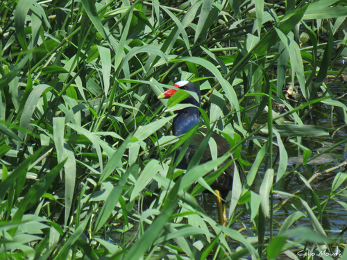  
Photo: [(c) Célio Moura Neto, some rights reserved (CC BY-NC)](https://www.inaturalist.org/observations/328665357) | [CC BY NC](https://creativecommons.org/licenses/by-nc/4.0/)  
Audio: [Bobby Wilcox](https://xeno-canto.org/391220) via [Xeno-Canto](https://xeno-canto.org/contributor/YHKQPPJDVP) | [CC BY-NC-SA 4.0](https://creativecommons.org/licenses/by-nc-sa/4.0/)  

**Rufous-sided Crake** (*Laterallus melanophaius*)  
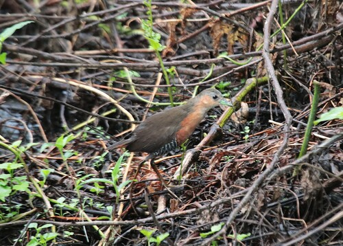  
Photo: [(c) Brian Wulker, some rights reserved (CC BY-NC)](https://www.inaturalist.org/observations/328220734) | [CC BY NC](https://creativecommons.org/licenses/by-nc/4.0/)  
Audio: [Bobby Wilcox](https://xeno-canto.org/396167) via [Xeno-Canto](https://xeno-canto.org/contributor/YHKQPPJDVP) | [CC BY-NC-SA 4.0](https://creativecommons.org/licenses/by-nc-sa/4.0/)  

**Wattled Jacana** (*Jacana jacana*)  
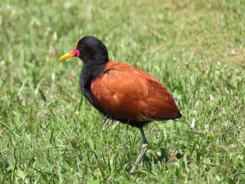  
Photo: [(c) Patrícia Nicoloso, some rights reserved (CC BY-NC)](https://www.inaturalist.org/observations/328778226) | [CC BY NC](https://creativecommons.org/licenses/by-nc/4.0/)  
Audio: [Bobby Wilcox](https://xeno-canto.org/392024) via [Xeno-Canto](https://xeno-canto.org/contributor/YHKQPPJDVP) | [CC BY-NC-SA 4.0](https://creativecommons.org/licenses/by-nc-sa/4.0/)  

# Atlantic Forest Birds - Photo & Audio Attributions

**Giant Snipe** (*Gallinago undulata*)  
  
Photo: [(c) luizanjos, some rights reserved (CC BY-NC)](https://www.inaturalist.org/observations/317397195) | [CC BY NC](https://creativecommons.org/licenses/by-nc/4.0/)  
Audio: [Bobby Wilcox](https://xeno-canto.org/391820) via [Xeno-Canto](https://xeno-canto.org/contributor/YHKQPPJDVP) | [CC BY-NC-SA 4.0](https://creativecommons.org/licenses/by-nc-sa/4.0/)  

**Boat-billed Heron** (*Cochlearius cochlearius*)  
  
Photo: [(c) Thomaz de Carvalho Callado, some rights reserved (CC BY)](https://www.inaturalist.org/observations/326359013) | [CC BY](https://creativecommons.org/licenses/by/4.0/)  
Audio: [Bobby Wilcox](https://xeno-canto.org/391953) via [Xeno-Canto](https://xeno-canto.org/contributor/YHKQPPJDVP) | [CC BY-NC-SA 4.0](https://creativecommons.org/licenses/by-nc-sa/4.0/)  

**Grey-headed Kite** (*Leptodon cayanensis*)  
  
Photo: [(c) Lucas Silva, some rights reserved (CC BY-NC)](https://www.inaturalist.org/observations/326467086) | [CC BY NC](https://creativecommons.org/licenses/by-nc/4.0/)  
Audio: [Bobby Wilcox](https://xeno-canto.org/366563) via [Xeno-Canto](https://xeno-canto.org/contributor/YHKQPPJDVP) | [CC BY-NC-SA 4.0](https://creativecommons.org/licenses/by-nc-sa/4.0/)  

**Great Black Hawk** (*Buteogallus urubitinga*)  
  
Photo: [(c) Bruno Oliani, some rights reserved (CC BY-NC)](https://www.inaturalist.org/observations/328550489) | [CC BY NC](https://creativecommons.org/licenses/by-nc/4.0/)  
Audio: [Bobby Wilcox](https://xeno-canto.org/391364) via [Xeno-Canto](https://xeno-canto.org/contributor/YHKQPPJDVP) | [CC BY-NC-SA 4.0](https://creativecommons.org/licenses/by-nc-sa/4.0/)  

**East Brazilian Pygmy Owl** (*Glaucidium minutissimum*)  
  
Photo: [(c) fabiomanfredini, some rights reserved (CC BY-NC)](https://www.inaturalist.org/observations/326688013) | [CC BY NC](https://creativecommons.org/licenses/by-nc/4.0/)  
Audio: [Bobby Wilcox](https://xeno-canto.org/391941) via [Xeno-Canto](https://xeno-canto.org/contributor/YHKQPPJDVP) | [CC BY-NC-SA 4.0](https://creativecommons.org/licenses/by-nc-sa/4.0/)  

**Ferruginous Pygmy Owl** (*Glaucidium brasilianum*)  
  
Photo: [(c) ricardo_metallicos, some rights reserved (CC BY-NC)](https://www.inaturalist.org/observations/328686117) | [CC BY NC](https://creativecommons.org/licenses/by-nc/4.0/)  
Audio: [Bobby Wilcox](https://xeno-canto.org/396067) via [Xeno-Canto](https://xeno-canto.org/contributor/YHKQPPJDVP) | [CC BY-NC-SA 4.0](https://creativecommons.org/licenses/by-nc-sa/4.0/)  

**Tawny-browed Owl** (*Pulsatrix koeniswaldiana*)  
  
Photo: [(c) Mariana Suzanne, some rights reserved (CC BY-NC)](https://www.inaturalist.org/observations/328424122) | [CC BY NC](https://creativecommons.org/licenses/by-nc/4.0/)  
Audio: [Bobby Wilcox](https://xeno-canto.org/365658) via [Xeno-Canto](https://xeno-canto.org/contributor/YHKQPPJDVP) | [CC BY-NC-SA 4.0](https://creativecommons.org/licenses/by-nc-sa/4.0/)  

**Green-backed Trogon** (*Trogon viridis*)  
  
Photo: [(c) gabo_utria, some rights reserved (CC BY-NC)](https://www.inaturalist.org/observations/328643822) | [CC BY NC](https://creativecommons.org/licenses/by-nc/4.0/)  
Audio: [Bobby Wilcox](https://xeno-canto.org/388411) via [Xeno-Canto](https://xeno-canto.org/contributor/YHKQPPJDVP) | [CC BY-NC-SA 4.0](https://creativecommons.org/licenses/by-nc-sa/4.0/)  

**Surucua Trogon** (*Trogon surrucura*)  
  
Photo: [(c) Marcelo Okamoto, some rights reserved (CC BY-NC)](https://www.inaturalist.org/observations/327973383) | [CC BY NC](https://creativecommons.org/licenses/by-nc/4.0/)  
Audio: [Bobby Wilcox](https://xeno-canto.org/366341) via [Xeno-Canto](https://xeno-canto.org/contributor/YHKQPPJDVP) | [CC BY-NC-SA 4.0](https://creativecommons.org/licenses/by-nc-sa/4.0/)  

**Black-throated Trogon** (*Trogon rufus*)  
  
Photo: [(c) NINA WENÓLI, some rights reserved (CC BY-NC)](https://www.inaturalist.org/observations/326672285) | [CC BY NC](https://creativecommons.org/licenses/by-nc/4.0/)  
Audio: [Bobby Wilcox](https://xeno-canto.org/366340) via [Xeno-Canto](https://xeno-canto.org/contributor/YHKQPPJDVP) | [CC BY-NC-SA 4.0](https://creativecommons.org/licenses/by-nc-sa/4.0/)  

**Ringed Kingfisher** (*Megaceryle torquata*)  
  
Photo: [(c) Rui Ribeiro, some rights reserved (CC BY-NC)](https://www.inaturalist.org/observations/328606456) | [CC BY NC](https://creativecommons.org/licenses/by-nc/4.0/)  
Audio: [Bobby Wilcox](https://xeno-canto.org/396165) via [Xeno-Canto](https://xeno-canto.org/contributor/YHKQPPJDVP) | [CC BY-NC-SA 4.0](https://creativecommons.org/licenses/by-nc-sa/4.0/)  

**Rufous-capped Motmot** (*Baryphthengus ruficapillus*)  
  
Photo: [(c) Gustavo C. M. Silva, some rights reserved (CC BY-NC)](https://www.inaturalist.org/observations/328285635) | [CC BY NC](https://creativecommons.org/licenses/by-nc/4.0/)  
Audio: [Bobby Wilcox](https://xeno-canto.org/391189) via [Xeno-Canto](https://xeno-canto.org/contributor/YHKQPPJDVP) | [CC BY-NC-SA 4.0](https://creativecommons.org/licenses/by-nc-sa/4.0/)  

**Chestnut-eared Aracari** (*Pteroglossus castanotis*)  
  
Photo: [(c) Bruno Oliani, some rights reserved (CC BY-NC)](https://www.inaturalist.org/observations/328508888) | [CC BY NC](https://creativecommons.org/licenses/by-nc/4.0/)  
Audio: [Bobby Wilcox](https://xeno-canto.org/365745) via [Xeno-Canto](https://xeno-canto.org/contributor/YHKQPPJDVP) | [CC BY-NC-SA 4.0](https://creativecommons.org/licenses/by-nc-sa/4.0/)  

**Saffron Toucanet** (*Pteroglossus bailloni*)  
  
Photo: [(c) David Kidwell, some rights reserved (CC BY-NC-SA)](https://www.inaturalist.org/observations/328133245) | [CC BY NC SA](https://creativecommons.org/licenses/by-nc-sa/4.0/)  
Audio: [Bobby Wilcox](https://xeno-canto.org/366675) via [Xeno-Canto](https://xeno-canto.org/contributor/YHKQPPJDVP) | [CC BY-NC-SA 4.0](https://creativecommons.org/licenses/by-nc-sa/4.0/)  

**Spot-billed Toucanet** (*Selenidera maculirostris*)  
  
Photo: [(c) David Kidwell, some rights reserved (CC BY-NC-SA)](https://www.inaturalist.org/observations/328133246) | [CC BY NC SA](https://creativecommons.org/licenses/by-nc-sa/4.0/)  
Audio: [Bobby Wilcox](https://xeno-canto.org/367356) via [Xeno-Canto](https://xeno-canto.org/contributor/YHKQPPJDVP) | [CC BY-NC-SA 4.0](https://creativecommons.org/licenses/by-nc-sa/4.0/)  

**Green-billed Toucan** (*Ramphastos dicolorus*)  
  
Photo: [(c) Emmanuel Arcencio, some rights reserved (CC BY-NC)](https://www.inaturalist.org/observations/328350715) | [CC BY NC](https://creativecommons.org/licenses/by-nc/4.0/)  
Audio: [Bobby Wilcox](https://xeno-canto.org/366915) via [Xeno-Canto](https://xeno-canto.org/contributor/YHKQPPJDVP) | [CC BY-NC-SA 4.0](https://creativecommons.org/licenses/by-nc-sa/4.0/)  

**Channel-billed Toucan** (*Ramphastos vitellinus ariel*)  
  
Photo: [(c) Nágyla Fachetti Coser, some rights reserved (CC BY-NC-SA)](https://www.inaturalist.org/observations/328223978) | [CC BY NC SA](https://creativecommons.org/licenses/by-nc-sa/4.0/)  
Audio: [Bobby Wilcox](https://xeno-canto.org/388432) via [Xeno-Canto](https://xeno-canto.org/contributor/YHKQPPJDVP) | [CC BY-NC-SA 4.0](https://creativecommons.org/licenses/by-nc-sa/4.0/)  

**Yellow-throated Woodpecker** (*Piculus flavigula*)  
  
Photo: [(c) David Kidwell, some rights reserved (CC BY-NC-SA)](https://www.inaturalist.org/observations/328133217) | [CC BY NC SA](https://creativecommons.org/licenses/by-nc-sa/4.0/)  
Audio: [Bobby Wilcox](https://xeno-canto.org/396080) via [Xeno-Canto](https://xeno-canto.org/contributor/YHKQPPJDVP) | [CC BY-NC-SA 4.0](https://creativecommons.org/licenses/by-nc-sa/4.0/)  

**Yellow-browed Woodpecker** (*Piculus aurulentus*)  
  
Photo: [(c) filipeprates, some rights reserved (CC BY)](https://www.inaturalist.org/observations/327405136) | [CC BY](https://creativecommons.org/licenses/by/4.0/)  
Audio: [Bobby Wilcox](https://xeno-canto.org/391912) via [Xeno-Canto](https://xeno-canto.org/contributor/YHKQPPJDVP) | [CC BY-NC-SA 4.0](https://creativecommons.org/licenses/by-nc-sa/4.0/)  

**Green-barred Woodpecker** (*Colaptes melanochloros*)  
  
Photo: [(c) Yby Naturalista, some rights reserved (CC BY-NC)](https://www.inaturalist.org/observations/328792448) | [CC BY NC](https://creativecommons.org/licenses/by-nc/4.0/)  
Audio: [Bobby Wilcox](https://xeno-canto.org/388433) via [Xeno-Canto](https://xeno-canto.org/contributor/YHKQPPJDVP) | [CC BY-NC-SA 4.0](https://creativecommons.org/licenses/by-nc-sa/4.0/)  

**Barred Forest Falcon** (*Micrastur ruficollis*)  
  
Photo: [(c) Bruno Luka de Souza Bambirra Silveira, some rights reserved (CC BY)](https://www.inaturalist.org/observations/320979634) | [CC BY](https://creativecommons.org/licenses/by/4.0/)  
Audio: [Bobby Wilcox](https://xeno-canto.org/391938) via [Xeno-Canto](https://xeno-canto.org/contributor/YHKQPPJDVP) | [CC BY-NC-SA 4.0](https://creativecommons.org/licenses/by-nc-sa/4.0/)  

**Collared Forest Falcon** (*Micrastur semitorquatus*)  
  
Photo: [(c) Roberto De Oliveira Silva, some rights reserved (CC BY-NC)](https://www.inaturalist.org/observations/326553606) | [CC BY NC](https://creativecommons.org/licenses/by-nc/4.0/)  
Audio: [Bobby Wilcox](https://xeno-canto.org/397310) via [Xeno-Canto](https://xeno-canto.org/contributor/YHKQPPJDVP) | [CC BY-NC-SA 4.0](https://creativecommons.org/licenses/by-nc-sa/4.0/)  

**Vinaceous-breasted Amazon** (*Amazona vinacea*)  
  
Photo: [(c) brianhof, some rights reserved (CC BY-NC)](https://www.inaturalist.org/observations/324450971) | [CC BY NC](https://creativecommons.org/licenses/by-nc/4.0/)  
Audio: [Bobby Wilcox](https://xeno-canto.org/365677) via [Xeno-Canto](https://xeno-canto.org/contributor/YHKQPPJDVP) | [CC BY-NC-SA 4.0](https://creativecommons.org/licenses/by-nc-sa/4.0/)  

